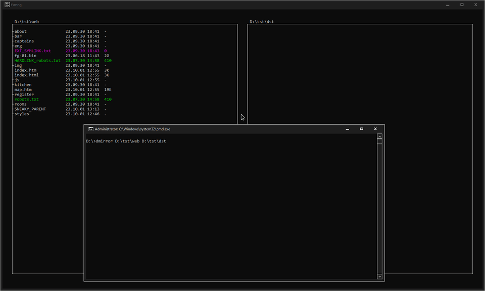
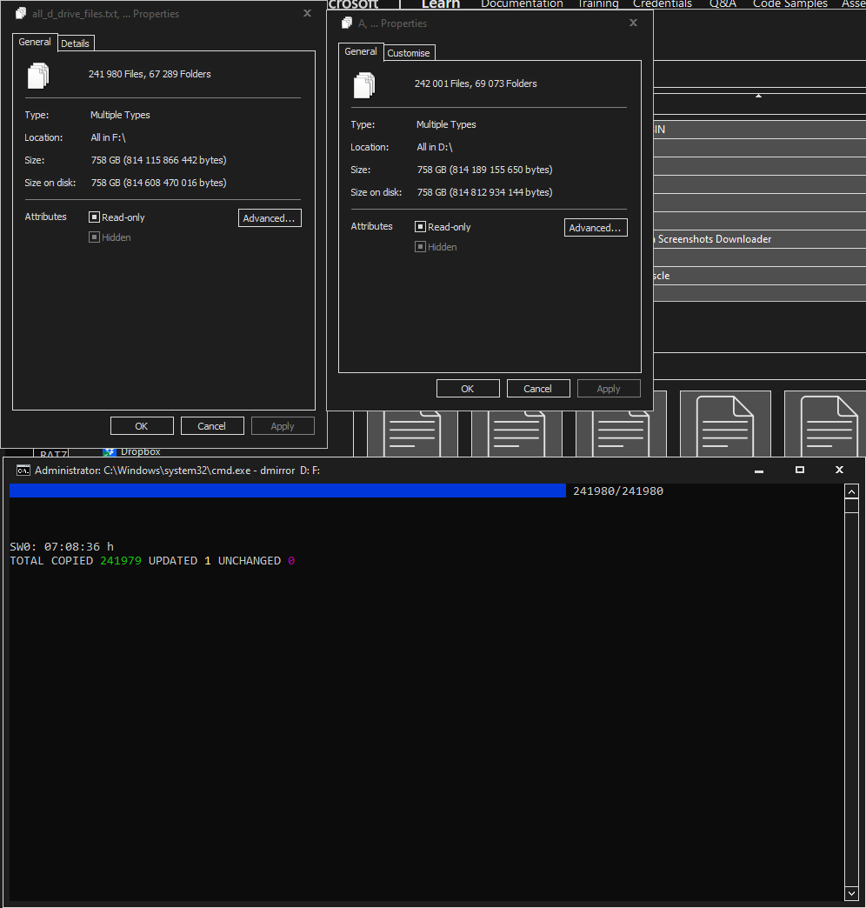

# Disk/Directory Mirrorer

[](../../releases/latest)
&nbsp;&nbsp;&nbsp;
&nbsp;&nbsp;&nbsp;[](https://www.buymeacoffee.com/sciencediscoverer)

Minimalistic backup utility based on raw Windows API and custom standard libraries optimised for Windows. It has no bloat, only does what it needs to do - mirrors the content of `SRC` (source) folder/drive into `DST` (destination) folder/drive. Better `robocopy` with full hard link support and timestamps preservation.



## Usage

To start the mirroring process, just pass `SRC` and `DST` as a command line parameters like this, with no trailing slashes:

```
dmirror [SRC] [DST]
```
Then, follow the instructions and confirm the beginning of the process.

### **[WARNING]** Files that are not present in `SRC` are **deleted** from `DST`! Make sure you select the correct destination!

For example, to mirror local disk `D:\` into external HDD `F:\`:

```
dmirror D: F:
```

To mirror directory structure rooted at `C:\Users\foo\Documents` into `D:\Backup\Documents`:

```
dmirror C:\Users\foo\Documents D:\Backup\Documents
```
*Note: use quotes `"D I R"` if `DIR` path contains spaces.*

## Current state

At the present moment this program is in the state of beta version. It does most of the important stuff, while missing some minor features. Currently implemented features are:

* Full hard link support; detection of all hard link groups in the file system and recreation of the groups in `DST`
* Preservation of all symbolic links
* Fast file system scanning (241980 files in 2.5 seconds, single core)
* Preservation of the original file's create/modify/access timestamps
* Preservation of all directories' attributes
* Removal of files in `DST` that are not present in `SRC`
* Updating modified files (modify date and/or size does not match `SRC` file)
* Skipping unchanged files
* Separate progress bars for total files and current file transfer
* Skipping small files' progress bar display, for decreased interface overhead
* Transfer speed display in `KB/s`

## Missing features

Eventually, if I'll be able to fish out any time, I plan to implement this features:

* Removal of dangling empty directories from `DST`
* Recreation of empty directories present inside `SRC` in `DST`
* Preservation of create/modify/access timestamps for all directories
* Average transfer speed calculation
* Accurate remaining time estimation
* "Quiet" mode with no pauses or confirmations (very dangerous!)
* Display of the currently transferring **BIG FILE**'s name
* Ability to pause the mirroring process, and resume it later
* Support for full live system drive mirroring

## Test Results

In my first full scale test this program was able to fully clone my internal non-system `D:\` 931.3 GB SSD drive into external USB 2.0 931.3 GB HDD `F:\` drive in 7 hours 8 minutes and 36 seconds (not counting the file system preprocessing time). The actual amount of data on `D:\` drive was 758 GB. It contained 241979 files (most of them where "localised" websites and photo/video archive). There was no errors or crushes during the whole execution time. Total RAM used was no more than 56 MB. Based on this test, I can make an assumption that this program is pretty dam stable!



*Note: the difference in file count is caused by screenshots that I took after the mirroring started. This screenshots was not scanned initially, so wasn't included in the mirror.*

## How to build

Just double-click the `msvc_build.cmd` file. Yep. As easy as this. Well, that is, if you have your Visual Studio installed, of course. And if your VS `vcvars64.bat` file is located at this path:

```
set "bat_dir=C:\Program Files\Microsoft Visual Studio\2022\Community\VC\Auxiliary\Build\vcvars64.bat"
```
If not, first of all, make sure the [Visual Studio](https://visualstudio.microsoft.com/downloads/) is installed. In the setup wizard you will see a huge list of useless features and bloat. Only the C++ build tools are actually needed. Switch to `Individual components` and try to find this in the humongous list:

```
MSVC vXXX - VS 202X C++ x64/x86 build tools (Latest)
```

After this you will have to merely locate the `vcvars64.bat` file and copy-paste the path to it into `msvc_build.cmd`. Then just launch it and wait until it does all the job for you. Yes, you don't even need to install or open the Visual Studio IDE itself. Ever.
